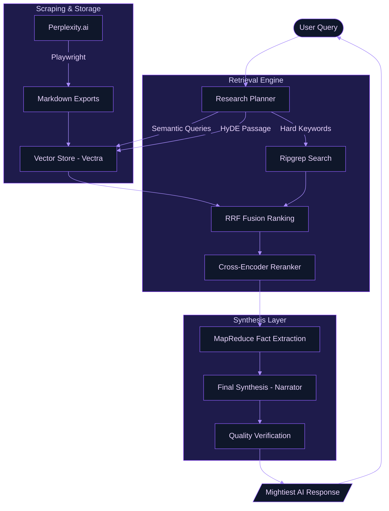
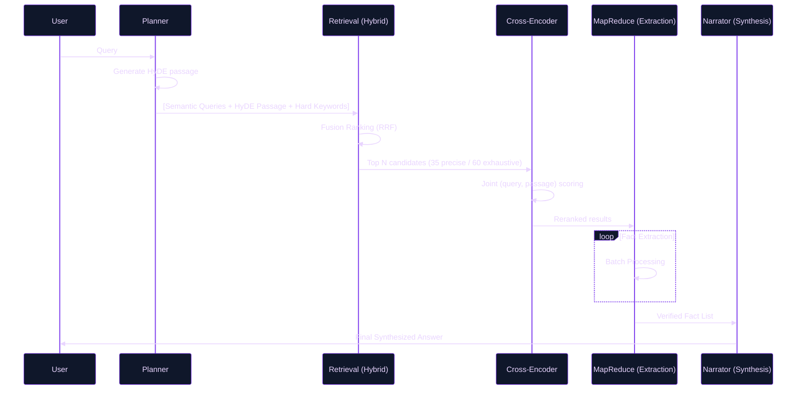

# System Architecture & Cognitive Foundations

This document elucidates the architectural blueprints and theoretical underpinnings of the Perplexity History Export tool. It is designed for those who seek to understand the mechanics of our "Mightiest RAG" implementation.

---

<!-- toc -->

- [1. High-Level Flow Diagram](#1-high-level-flow-diagram)
- [2. RAG Cognitive Structure](#2-rag-cognitive-structure)
  * [Stage A: Adaptive Planning](#stage-a-adaptive-planning)
  * [Stage B: Hybrid Retrieval & Fusion](#stage-b-hybrid-retrieval--fusion)
  * [Stage B¹: Cross-Encoder Reranking](#stage-b1-cross-encoder-reranking)
  * [Stage C: Granular MapReduce Fact Extraction](#stage-c-granular-mapreduce-fact-extraction)
- [3. Theoretical Foundations](#3-theoretical-foundations)
  * [Hybrid Search & RRF](#hybrid-search--rrf)
  * [Hypothetical Document Embeddings (HyDE)](#hypothetical-document-embeddings-hyde)
  * [Cross-Encoder Reranking](#cross-encoder-reranking)
  * [Retrieval-Augmented Generation (RAG)](#retrieval-augmented-generation-rag)
  * [MapReduce for Context Compression](#mapreduce-for-context-compression)
- [4. Visualizing the Retrieval Loop](#4-visualizing-the-retrieval-loop)

<!-- tocstop -->

---

## 1. High-Level Flow Diagram

The following diagram illustrates the lifecycle of data, from the initial extraction from Perplexity.ai to the interactive synthesis in the REPL.

---

## 2. RAG Cognitive Structure

Our RAG implementation is not a simple "retrieve and stuff" pipeline. It follows a multi-stage cognitive process inspired by modern IR (Information Retrieval) and LLM orchestration patterns.

### Stage A: Adaptive Planning

Before any retrieval, the system acts as a **Research Planner**. It decomposes the user's query into:

- **Strategy**: Selecting between `precise` (targeted facts, pool of 35) or `exhaustive` (broad historical overview, pool of 60).
- **Semantic Variations**: Generating multiple search phrases to cover different linguistic facets of the query.
- **Hard Keywords**: Identifying unique entities or technical IDs that require exact-match precision.
- **HyDE Passage**: Generating a short hypothetical answer passage — 1-2 sentences that would plausibly appear in stored history for this question. This passage is embedded and searched alongside the query variations, improving recall when the user's question wording diverges from how the content was originally written.

### Stage B: Hybrid Retrieval & Fusion

We employ a **Hybrid Search** strategy, combining the strengths of dense and sparse retrieval:

- **Dense (Vector)**: Captures semantic intent and conceptual similarity using embeddings (`nomic-embed-text`). Runs once per semantic query variation and once for the HyDE passage.
- **Sparse (Exact)**: Leverages `ripgrep` for high-velocity exact string matching, ensuring technical IDs or specific names are never missed.

Results from all pools are merged using **Reciprocal Rank Fusion (RRF)**, which provides a robust ranking by combining the ordinal positions of items from different search pools without needing normalized scores.

### Stage B¹: Cross-Encoder Reranking

After RRF fusion, the top candidates are passed to a **cross-encoder reranker** before fact extraction. Unlike the bi-encoder embeddings used for retrieval (which score query and passage independently), a cross-encoder processes the query and each passage jointly, enabling it to reason about fine-grained relevance:

- **Model**: `Xenova/ms-marco-MiniLM-L-6-v2` — runs locally via ONNX (`@huggingface/transformers`), no API key required.
- **Quantization**: Loaded in `int8` for a 3× latency reduction with <0.5% rank-correlation loss versus fp32.
- **Batching**: Processed in chunks of 64 pairs for optimal throughput.
- **Fallback**: Gracefully skips reranking if the package is not installed, preserving the RRF order.
- **Implementation note**: The raw relevance logit is read directly from `AutoModelForSequenceClassification` output — the high-level `pipeline()` API is intentionally bypassed as it normalizes single-class regression heads to a constant `score: 1.0`.

### Stage C: Granular MapReduce Fact Extraction

To mitigate "lost in the middle" phenomena and context window saturation, we utilize a **MapReduce** approach:

1. **Map**: Each snippet is analyzed in small, high-density batches to extract atomic facts, code snippets, and dates.
2. **Reduce**: These verified facts are then synthesized into a final, authoritative response with full source provenance.

---

## 3. Theoretical Foundations

Our architecture is informed by several key papers and concepts in the field of AI and Information Retrieval:

### Hybrid Search & RRF

- **Reciprocal Rank Fusion (RRF)**: Based on the principle that combining multiple search orderings can significantly outperform any single ordering.
  - _Reference:_ [Cormack et al., 2009. Reciprocal Rank Fusion outperforms Condorcet and Individual Rank Learning Methods.](https://cormack.uwaterloo.ca/cormacksigir09-rrf.pdf) (SIGIR 2009, DOI: 10.1145/1571941.1572114)

### Hypothetical Document Embeddings (HyDE)

- **HyDE**: Rather than embedding the raw query, the LLM first generates a hypothetical document that would answer the query, then that document is embedded for retrieval. This closes the lexical gap between question phrasing and answer phrasing in the vector space.
  - _Reference:_ [Gao et al., 2022. Precise Zero-Shot Dense Retrieval without Relevance Labels.](https://arxiv.org/abs/2212.10496)

### Cross-Encoder Reranking

- **Two-Stage Retrieval**: The standard industry pattern of using a fast bi-encoder for candidate retrieval followed by a slower but more precise cross-encoder for reranking. The cross-encoder reads the full (query, passage) pair jointly, capturing interaction signals the bi-encoder cannot.
  - _Reference:_ [Nogueira & Cho, 2019. Passage Re-ranking with BERT.](https://arxiv.org/abs/1901.04085)

### Retrieval-Augmented Generation (RAG)

- **General RAG Framework**: We follow the core paradigm of grounding LLM outputs in external, verifiable data.
  - _Reference:_ [Lewis et al., 2020. Retrieval-Augmented Generation for Knowledge-Intensive NLP Tasks.](https://arxiv.org/abs/2005.11401)

### MapReduce for Context Compression

- **Summarization & Synthesis**: Our fact extraction layer mirrors the "MapReduce" chain pattern, effectively handling long-context retrieval by distilling information before final generation.
  - _Reference:_ [Wu et al., 2021. Recursively Summarizing Books with Human Feedback.](https://arxiv.org/abs/2109.10862) (Applying hierarchical summarization principles).

---

## 4. Visualizing the Retrieval Loop

